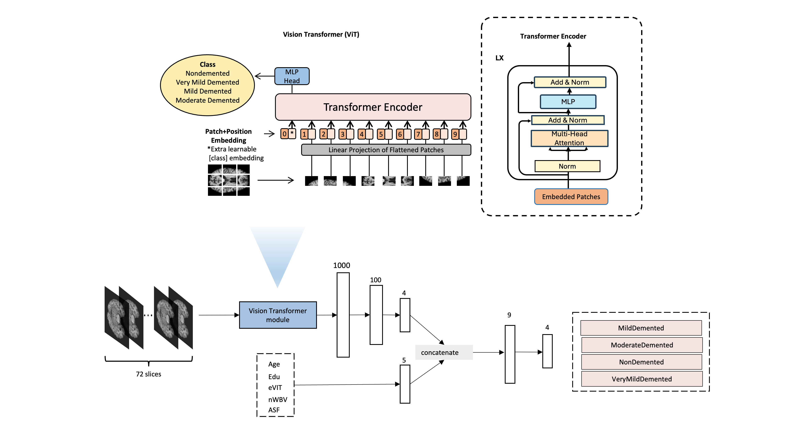
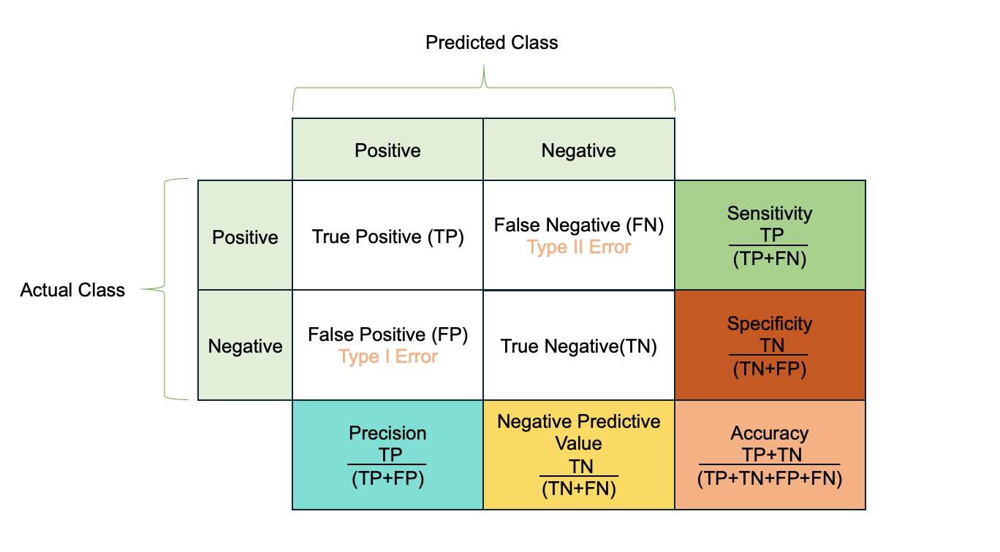

# ccn_Alzheimer

## Method
The network architecture employs alternating blocks of multi-head self-attention mechanisms and feed-forward networks\cite{vaswani2017attention}. Each computational block is preceded by layer normalization and followed by residual connections, following the design principles established in recent works (Wang et al., 2019; Baevski \& Auli, 2019). The feed-forward component adopts a two-layer structure with GELU activation in between.

### Model Overview

The architectural framework of our model comprises several key components. Initially, sequential MRI scans from individual subjects undergo preprocessing and consolidation into a volumetric stack. Missing slices within the sequence are reconstructed through interpolation techniques to maintain spatial continuity. Each patient dataset is subsequently formatted into a standardized three-dimensional array of dimensions 72×465×232, representing 72 consecutive MRI slices. These preprocessed volumes serve as input to either the Vision Transformer (ViT) architecture or comparative baseline models. The initial high-dimensional output tensor (1000-dimensional) undergoes progressive dimensionality reduction through two fully connected layers, first to 100 dimensions and subsequently to 4 dimensions. Concurrently, demographic and clinical variables (Age, Education level, eVIT, normalized Whole Brain Network metrics, and ASF) are integrated into the pipeline and concatenated with the 4-dimensional feature vector derived from the ViT module. This concatenation yields a 9-dimensional feature representation, which is finally projected onto a 4-dimensional output space corresponding to the target classification categories.

*Figure 1: Architectural overview of the proposed model, illustrating the integration of MRI data processing, Vision Transformer components, and clinical feature fusion.*

<!-- \begin{figure*}[htbp]   
    \centering
    \makebox[\textwidth][c]{\includegraphics[width=1\textwidth]{8pager/figures/Model Overview.png}}
     \caption{Overview of the MRITMM framework}
    \label{fig: Overview of the MRITMM framework}
\end{figure*} -->

### Vision Transformer
The Vision Transformer (ViT) represents a pioneering adaptation of the transformer architecture, originally designed for natural language processing, to computer vision tasks. This model, introduced by Dosovitskiy et al.\cite{dosovitskiy2021an}, demonstrates remarkable performance in image classification tasks by treating images as sequences of patches. In the ViT architecture, the input image is first divided into fixed-size patches (e.g., 16×16 pixels), which are then linearly embedded and combined with position embeddings. These embedded patches serve as the equivalent of tokens in the traditional transformer architecture. A learnable [CLS] token is attached to the sequence of embedded patches, whose final state serves as an image representation for classification. The model processes these sequences through multiple transformer encoder blocks, each consisting of multi-headed self-attention mechanisms and multilayer perceptrons (MLPs) with Layer Normalization (LN). This architecture enables the model to effectively capture both local and global dependencies within the image. The self-attention mechanism allows the model to dynamically weigh the importance of different patches, facilitating the identification of relevant features for the specific task at hand. Despite its departure from traditional convolutional approaches, ViT has demonstrated competitive or superior performance compared to state-of-the-art convolutional neural networks, particularly when pretrained on large-scale datasets.

Vision transformer architecture:
1. Input Tokens \& Embeddings

Each token $t$ is represented as an embedding $h_t \in \mathbb{R}^d$

$d$ is the embedding dimension, $n_h$ is the number of attention heads, and each head has a dimension $d_h$ such that $d = n_h \times d_h$.

2. Computing Queries, Keys, and Values

For each token, queries $g_t$, keys $k_t$, and values $v_t$ are computed as:
<!-- \begin{align} -->
$g_t = W^Q h_t$, $k_t = W^K h_t$, $v_t = W^V h_t$
<!-- \end{align} -->

$W^Q$, $W^K$, $W^V \in \mathbb{R}^{d_h n_h \times d}$ are learned projection matrices.

3. Splitting into multiple heads

Queries, keys, and values are split into $n_h$ heads:
<!-- \begin{align} -->
$q_t = [q_{t,1}; q_{t,2}; \ldots; q_{t,n_h}]$

$k_t = [k_{t,1}; k_{t,2}; \ldots; k_{t,n_h}]$

$v_t = [v_{t,1}; v_{t,2}; \ldots; v_{t,n_h}]$

<!-- \end{align} -->
Each $q_{t,i}$, $k_{t,i}$, $v_{t,i} \in \mathbb{R}^{d_h}$ corresponds to an attention head.

4. Calculating Attention Scores

$$\text{Attention Score}_{t,i} = \text{softmax}\left(\frac{\mathbf{q}_{t,i}^\top\mathbf{k}_{j,i}}{\sqrt{d_h}}\right)$$

This ensures attention weights sum to 1.

5. Computing Output

The weighted sum of values gives the output per head:

$$\mathbf{o}_{t,i} = \sum_{j=1}^{t}\text{Attention Score}_{t,i}\cdot v_{j,i}$$

Outputs from all heads are concatenated and projected back using W^O ∈ ℝ^(d × d_h n_h):

$$u_t = W^O[\mathbf{o}_{t,1}; \mathbf{o}_{t,2}; \ldots; \mathbf{o}_{t,n_h}]$$

### MRI Data Preprocessing
This study utilized an Alzheimer's brain MRI dataset based on the OASIS project\cite{yiwei_lu_2024}(https://sites.wustl.edu/oasisbrains/home/oasis-1/). The dataset contains axial slice MRI images from 457 subjects. Each image was subjected to rigorous preprocessing procedures, including conversion from NIfTI file format to PNG format and skull stripping. To ensure data quality, researchers manually removed images that contain black regions and incomplete brain displays. Each image sample was assigned specific naming conventions to trace back to the corresponding OASIS research phase and individual information. In particular, the data set presents a class imbalance issue, which needs to be addressed through techniques such as upsampling in subsequent analyzes. The construction of the data set adhered to strict quality control standards, providing reliable imaging data for deep learning research in Alzheimer's disease.

To address missing MRI slices in the dataset, we implemented an interpolation strategy. For single missing slices, we computed the mean value between the adjacent anterior and posterior slices. In cases of multiple consecutive missing slices, we performed linear interpolation between the last available slice before the gap and the first available slice after the gap, generating a series of interpolated slices to fill the missing sequence. Furthermore, subjects with incomplete clinical assessment data (MMSE, CDR, SES) were excluded from the analysis to maintain data integrity. After applying these inclusion criteria, which require both complete MRI sequences and comprehensive clinical assessment data (MMSE, CDR, SES), the final study cohort consisted of 58 subjects.

### Model training

Following the architectural design phase, we proceeded with model training and evaluation. The training protocol implemented random shuffling of the entire dataset during each of the 10,000 training epochs to ensure stochastic gradient descent optimization and prevent overfitting. We conducted comparative analyzes across multiple state-of-the-art architectures, including ResNet-152, AlexNet, VGG16, GoogLeNet and Vision Transformer (ViT). The dataset was partitioned using a stratified split ratio of 7: 3 for the training and testing sets, respectively. To facilitate efficient training of deep architectures and improve convergence, weights were initialized using Gaussian distribution (normal initialization). The implementation was executed using the PyTorch framework (version 2.4.1), leveraging its robust deep learning capabilities and optimized computational infrastructure. For reproducibility, we initialized the random seed to 42 and employed the Adam optimizer with a learning rate of $10^{-6}$.

###Export-trained model

Following completion of the training phase, the optimized model parameters were serialized and exported for subsequent evaluation and deployment. The convergence of the model on the complete dataset eliminated the necessity for iterative retraining procedures. These pre-trained models serve as the foundation for downstream tasks and inference operations. The persistence of trained weights enables efficient model deployment and reproducible results across different experimental contexts.

###Testing model

The performance of the trained model was evaluated through extensive testing on a diverse set of test data. The model performs multi-class classification across four distinct diagnostic categories related to AD progression. Model predictions were systematically compared against ground truth labels in the test set. Quantitative assessment of the model's discriminative capabilities was conducted through rigorous evaluation metrics, comparing predicted classifications against clinically validated diagnoses. This evaluation framework enables an objective assessment of the generalization performance of the model and its clinical utility in AD classification tasks.

###Model evaluation

Model evaluation was conducted through comprehensive performance analysis on both training and test sets. Quantitative assessment was performed by comparing model predictions against ground truth labels in the held-out test dataset. Multiple performance metrics were employed to rigorously evaluate the model's discriminative capabilities. The primary evaluation metric utilized was classification accuracy, which quantifies the overall predictive performance. Additionally, we employed a comprehensive suite of complementary metrics including precision (positive predictive value), recall (sensitivity), specificity (true negative rate), and F1-score (harmonic mean of precision and recall) to provide a thorough assessment of the model's performance across different aspects of classification. These metrics collectively offer a robust framework for evaluating the model's clinical utility and generalization capabilities. The mathematical formulations for these evaluation metrics are defined as follows:

$$Accuracy = \frac{TP + TN}{TP + TN + FP + FN}$$

$$Precision = \frac{TP}{TP + FP}$$

$$Recall~(Sensitivity) = \frac{TP}{TP + FN}$$

$$Specificity = \frac{TN}{TN + FP}$$

$$F1\text{-}score = 2 \times \frac{Precision \times Recall}{Precision + Recall}$$

TP, TN, FP, and FN represent True Positives, True Negatives, False Positives, and False Negatives, respectively.

    *Figure 2: Mathematical formulations for model performance evaluation metrics including Accuracy, Precision, Recall (Sensitivity), Specificity, and F1-score. These metrics provide comprehensive assessment of the model's classification performance, where TP = True Positives, TN = True Negatives, FP = False Positives, and FN = False Negatives.*

### Statistical analysis
To evaluate the significant differences in clinical variables between normal cognition and various AD subtypes within this dataset, the Kruskal-Wallis Rank Sum Test was employed for continuous variables, while the Chi-square test was utilized for categorical variables. The Spearman’s rank correlation coefficient test was used to determine the correlation among clinical variables and the consistency between the predicted MMSE value and true values.

